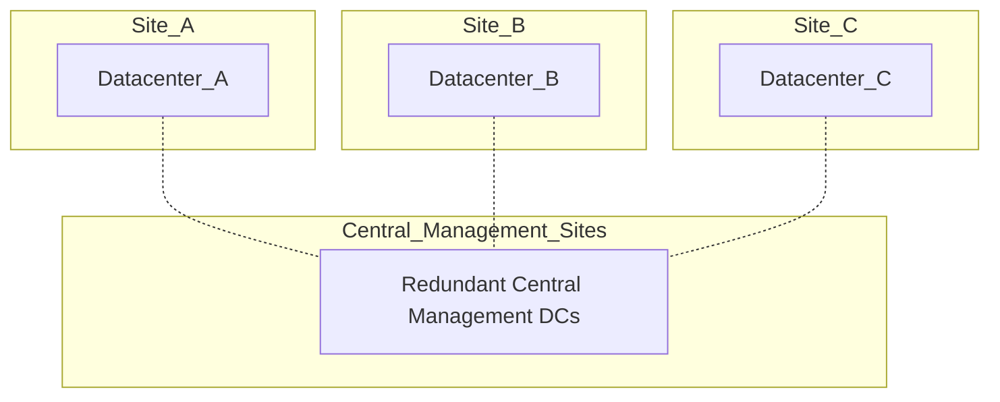

# Example

Simple example with a mermaid diagram:



Create a pdf version of it using the docker container marcelwiget/pandoc-mermaid:

```
$ ls -l

$ docker run -ti --rm -u `id -u $USER` --cap-add=SYS_ADMIN -v $PWD:/u \
  marcelwiget/pandoc-mermaid \
  pandoc --pdf-engine=xelatex \
  --filter=pandoc_filter.py \
  EXAMPLE.md \
  -o example.pdf

$ ls -l example.pdf
```

The folder mermaid-images contains the extracted mermaid markdown and generated images and can be deleted after the run.

